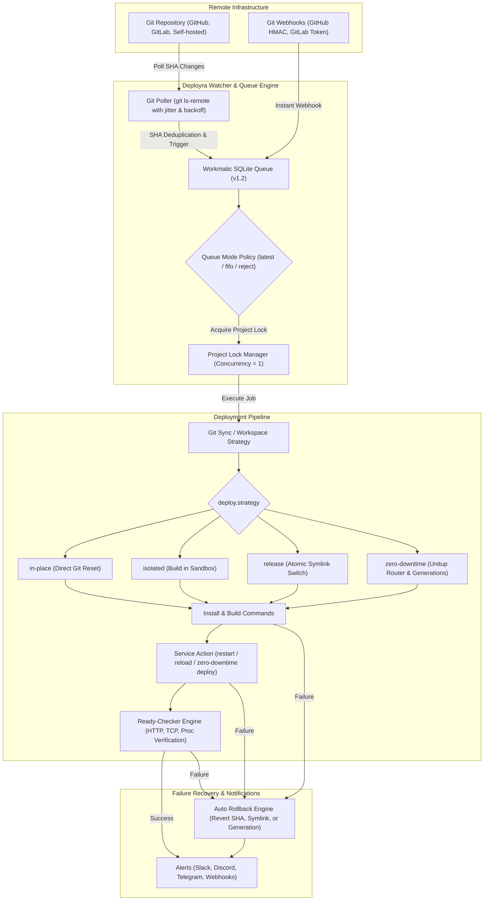

# Deployra 🚀

Lightweight, platform-independent & language-agnostic VPS deployment orchestrator.

## What is Deployra?

Deployra is a 100% language and framework-independent VPS deployment orchestrator. Whether your application is built with **Node.js, Go, Python, Rust, PHP, Java, Ruby, Docker binaries, or static HTML**, Deployra automatically monitors remote Git repositories, queues background deployments via an embedded execution engine ([Workmatic](https://github.com/litepacks/workmatic)), manages systemd service lifecycles and zero-downtime traffic switching via [Unitup](https://github.com/litepacks/unitup), verifies application post-deploy readiness via [Ready-checker](https://github.com/litepacks/ready-checker), and executes automated rollbacks on failure.

---

## Architecture



> [!NOTE]
> **Internal Execution Engines**: Deployra integrates [`workmatic`](https://github.com/litepacks/workmatic) (persistent SQLite job queue), [`unitup`](https://github.com/litepacks/unitup) (systemd service & zero-downtime manager), and [`ready-checker`](https://github.com/litepacks/ready-checker) (application readiness engine) as internal implementation layers. Users **never** have to write internal package names in their configuration files.

---

## Features

- 🌐 **Language & Framework Agnostic**: Deploys any stack (Node.js, Go, Python, Rust, PHP, Java, Docker, Static HTML) without language-specific plugins.
- ⚡ **Zero-Downtime Deployments**: Native dual-generation process spawning, atomic HTTP proxy routing, in-flight connection draining, and instant generation rollback powered by [Unitup](https://github.com/litepacks/unitup).
- 🐤 **Canary Traffic Shifting**: Split traffic to test a new commit against a percentage of requests (`--canary --weight 15%`) before full release, then promote with `deployra promote`.
- 🔗 **Atomic Symlink Releases**: Production release directories (`releases/<id>`) with atomic `current` symlink swapping and automatic pruning (`releasesToKeep`).
- 🔄 **Provider-Independent Polling & Webhooks**: Lightweight `git ls-remote` change detection with jitter and exponential backoff, plus built-in GitHub/GitLab webhook receivers.
- 🚦 **Workmatic Engine Integration**: Persistent background job queue powered by [Workmatic](https://github.com/litepacks/workmatic) with concurrency locks (`1` per project) and configurable queue modes (`latest`, `fifo`, `reject`).
- 🛠 **Systemd Service Management**: Automated systemd user service management, restart, and status tracking.
- 🩺 **Comprehensive Readiness Verification**: Post-deploy health checks via [Ready-checker](https://github.com/litepacks/ready-checker) (HTTP, HTTPS, TCP, status codes, response bodies, file checks).
- ⏪ **Automated Rollbacks**: Reverts repository commit, atomic symlink, or router generation automatically on build/health failure.
- 🔔 **Multi-Channel Alerting**: Built-in notifications for Slack, Discord, Telegram, and generic JSON webhooks.
- 🩹 **Self-Repair & Health Watchdogs**: Automatically detects and heals stale Git lock files (`index.lock`), checks disk usage, and auto-restarts failed services.
- 🔐 **Security & Secret Masking**: Command execution with argument arrays (no shell injection risk) and automatic redaction of tokens/passwords from logs.

---

## Installation

```bash
# Install via npm
npm install -g deployra

# Or clone and build
git clone https://github.com/litepacks/deployra.git
cd deployra
npm install
npm run build
npm link
```

---

## Quick Start

### 1. Initialize Sample Configuration

```bash
deployra init
```

This creates a `deployra.config.yaml` file in the current directory:

```yaml
project:
  name: api
  path: /var/www/api

source:
  remote: origin
  branch: main

watch:
  interval: 30s

deploy:
  strategy: in-place # Options: in-place | isolated | release | zero-downtime
  concurrency: 1
  queueMode: latest
  dirtyWorkspace: reject
  timeout: 10m

  retry:
    attempts: 2
    backoff: 10s

  commands:
    install:
      - npm ci
    build:
      - npm run build

  service:
    name: api
    action: restart

  ready:
    url: http://127.0.0.1:3000/health
    timeout: 45s
    interval: 2s

  rollback:
    enabled: true
    on:
      - build-failure
      - service-failure
      - ready-failure
```

### 2. Register & Validate Project

```bash
deployra add deployra.config.yaml
deployra doctor
```

### 3. Start Watcher Daemon

```bash
deployra watch
```

---

## Deployment Strategies

Deployra supports 4 deployment strategies to match any infrastructure need:

| Strategy | Description | Best For |
| :--- | :--- | :--- |
| **`in-place`** *(default)* | Updates the repository directly in its working directory, runs build commands, and restarts the service. | Simple apps, lightweight services, internal tools. |
| **`isolated`** | Fetches and compiles code in an isolated workspace sandbox before syncing changes to the live directory. | Apps with intensive builds where live directory shouldn't see intermediate build states. |
| **`release`** | Clones each deployment to a timestamped folder (`releases/<id>`) and switches an atomic symlink (`current`). Prunes old releases automatically (`releasesToKeep: 5`). | Web servers, PHP apps, static frontends requiring instant rollback. |
| **`zero-downtime`** | Unitup starts the new version on an internal port, verifies readiness, atomically shifts HTTP proxy traffic, drains in-flight requests, and stops the retired generation without dropping a single request. | High-traffic HTTP APIs and microservices. |

### Zero-Downtime & Canary Configuration Example

```yaml
project:
  name: web-api
  path: /srv/web-api

deploy:
  strategy: zero-downtime
  port: 8080               # Public port where Unitup HTTP router listens
  drainTimeout: 15s        # Grace period for in-flight requests on previous generation

  service:
    name: web-api
    command: node dist/server.js

  ready:
    url: http://127.0.0.1:8080/health
    timeout: 30s
    interval: 1s

  rollback:
    enabled: true
```

#### Triggering Canary Deployments & Promoting

```bash
# Deploy a canary generation that receives 15% of public traffic
deployra deploy web-api --canary --weight 15%

# Check active generations and canary split
deployra status web-api

# Promote the canary to 100% primary traffic
deployra promote web-api
```

---

## CLI Reference

| Command | Description |
| :--- | :--- |
| `deployra init [path]` | Generate a sample `deployra.config.yaml` file |
| `deployra add [configPath]` | Register a project configuration with Deployra |
| `deployra remove [app]` | Deregister a project from Deployra registry |
| `deployra list` | List all registered projects, SHAs, and active strategies |
| `deployra watch [app] [-d]` | Start long-running polling daemon (`--dry-run` to simulate) |
| `deployra check [app]` | Perform a one-shot remote change check |
| `deployra deploy [app] [options]` | Trigger a manual deployment (`-d` dry-run, `-i` inline, `--canary`, `--weight <pct>`) |
| `deployra promote [app]` | Promote active canary generation to 100% primary traffic |
| `deployra rollback [app] [options]` | Interactive or targeted rollback to a previous successful deployment |
| `deployra cancel [target]` | Cancel an active or queued deployment |
| `deployra status [app] [-w]` | View status summary or launch real-time live TUI dashboard (`--watch`) |
| `deployra stats [app]` | Display deployment metrics, success rates, and step durations |
| `deployra logs [app]` | View deployment step logs and stderr outputs |
| `deployra history [app]` | View past deployment history |
| `deployra clean [app]` | Clean up old deployment history and optimize SQLite database |
| `deployra notify-test [app]` | Send test alerts to verify configured notification channels |
| `deployra doctor [configPath]` | Run system diagnostics (Git, SQLite, systemd, disk space) |
| `deployra service <action>` | Manage Deployra as a systemd user service (`install\|start\|stop\|restart\|status\|uninstall`) |
| `deployra upgrade` | Check for and install CLI updates |
| `deployra uninstall` | Completely uninstall Deployra daemon, service files, and database |

---

## Configuration Reference

### `project`
- `name` (string, required): Unique project name.
- `path` (string, required): Absolute filesystem path to working tree.

### `source`
- `remote` (string, default: `origin`): Git remote name.
- `branch` (string, default: `main`): Target branch to track.

### `watch`
- `interval` (string/number, default: `30s`): Polling interval (e.g. `30s`, `1m`, `500ms`).

### `deploy`
- `strategy` (enum: `in-place` | `isolated` | `release` | `zero-downtime`, default: `in-place`): Deployment strategy.
- `port` (number, optional): Public router port for `zero-downtime` strategy.
- `drainTimeout` (string/number, optional): In-flight request drain timeout (e.g. `15s`, default: `10s`).
- `canary.enabled` (boolean, default: `false`): Enable canary deployment mode.
- `canary.weight` (string/number, default: `0.1`): Traffic proportion routed to canary (e.g. `10%` or `0.1`).
- `releasesToKeep` (number, default: `5`): Number of historical releases to retain when using `strategy: release`.
- `workspacePath` (string, optional): Custom workspace directory for `isolated` strategy.
- `concurrency` (number, default: `1`): Concurrent deployment execution limit.
- `queueMode` (enum: `latest` | `fifo` | `reject`, default: `latest`): Queue behavior when new commits arrive.
- `dirtyWorkspace` (enum: `reject` | `reset` | `stash`, default: `reject`): Handling uncommitted workspace changes.
- `timeout` (string/number, default: `10m`): Maximum overall pipeline timeout.
- `retry.attempts` (number, default: `2`): Retry count for failed step commands.
- `retry.backoff` (string/number, default: `10s`): Delay between step retry attempts.
- `commands.install` (array of strings): Dependency installation shell commands.
- `commands.build` (array of strings): Application compilation/build shell commands.
- `service.name` (string): Systemd service name (defaults to `project.name`).
- `service.action` (enum: `start` | `restart` | `reload` | `none`, default: `restart`): Action performed on service.
- `service.command` (string, optional): Start command for service execution (e.g. `node server.js`).
- `service.script` (string, optional): Entrypoint script path.
- `service.memoryMax` (string, optional): Systemd memory limit (e.g. `512M`, `1G`).
- `service.restartSec` (string, optional): Restart delay interval (e.g. `5s`).
- `ready` (object): Post-deployment readiness check specifications.
- `rollback.enabled` (boolean, default: `true`): Auto-rollback trigger toggle.

### `notifications` *(optional)*

```yaml
notifications:
  on: [failure, rollback] # Options: start, success, failure, rollback
  slack:
    webhookUrl: https://hooks.slack.com/services/...
  discord:
    webhookUrl: https://discord.com/api/webhooks/...
  telegram:
    botToken: 123456:ABC-DEF1234ghIkl-zyx57W2v1u123ew11
    chatId: -100123456789
  webhook:
    url: https://internal.company.com/alerts/deployra
    secret: my-shared-secret
```

---

## Concurrency & Queue Management

When a new deployment is triggered while another deployment is currently active, Deployra uses an embedded Workmatic job queue and SQLite project locking to guarantee safety:

1. **SHA Deduplication**: Identical commit SHAs currently active or queued are skipped automatically to prevent redundant builds.
2. **Project Locking (`acquire-lock`)**: Each deployment acquires an atomic project lock before executing workspace or git operations, preventing concurrent build conflicts.
3. **Execution Queue (`concurrency: 1`)**: Deployments for a project are queued and processed sequentially.
4. **Queue Modes (`deploy.queueMode`)**:
   - **`latest`** *(default)*: When a new commit is detected while a deployment is active, older pending/queued deployments are automatically cancelled and replaced by the newest commit.
   - **`fifo`**: All deployment requests are queued in First-In, First-Out order and executed one after another.
   - **`reject`**: If a deployment is currently running or queued, any incoming deployment requests are rejected immediately.

### Multi-Project Performance & Polling Safety

When monitoring dozens of projects simultaneously in a single daemon instance, Deployra incorporates built-in protections against thundering herd network spikes:

- **Initial Check Staggering**: Initial polling checks are staggered by a 250ms offset per project on startup.
- **Interval Desynchronization Jitter**: A randomized jitter (+0..500ms) is applied to recurring polling timers to desynchronize check cycles.
- **Exponential Backoff on Errors**: Repositories encountering network or Git server failures automatically apply exponential backoff (up to 16x interval multiplier) to prevent hammering failing remotes.

---

## Daemon & Service Management

To install Deployra daemon as a systemd user service:

```bash
deployra service install
deployra service start
deployra service status
```

---

## Security Best Practices

1. **Secret Masking**: Sensitive environment variables and secrets matching `KEY|TOKEN|SECRET|PASSWORD|AUTH` are automatically redacted from logs.
2. **Safe Command Execution**: Commands run with argument arrays (`safeExec`) to prevent shell injection vulnerabilities.
3. **Disk Space Verification**: Pre-flight checks prevent builds on disks exceeding 95% usage.
4. **Non-Root Execution**: Running Deployra directly as `root` is warned against. Dedicated deployment service accounts should be used.

---

## Troubleshooting

- **Doctor Check**: Run `deployra doctor` to verify Git, SQLite permissions, systemd access, and remote connectivity.
- **Inspect Logs**: Run `deployra logs <app>` to view step-level exit codes and tracebacks.
- **Interactive Status Dashboard**: Run `deployra status --watch` to monitor live pipeline execution.
- **Reset DB**: SQLite database is located at `~/.deployra/deployra.db` (or custom path set via `DEPLOYRA_DB_PATH`).

---

## License

MIT © [litepacks](https://github.com/litepacks)
