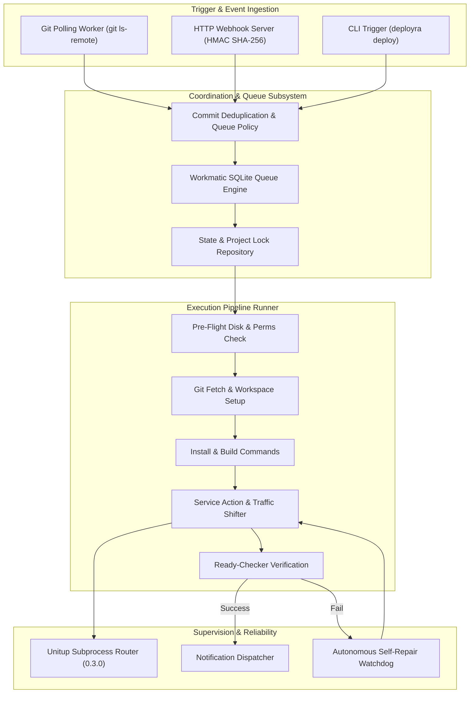

# Architecture & Subsystems ⚙️

Deployra is engineered with a modular, resilient architecture designed to prevent deployment deadlock, handle process crashes gracefully, and protect host resources.

---

## 🏛️ System Architecture

---

## 🧩 Core Subsystems

### 1. Watcher & Git Poller (`src/watcher/`)
The Source Watcher continuously tracks remote branches for every registered project. Key capabilities include:
- **Jitter & Backoff**: Randomized intervals prevent API stampedes on Git providers.
- **Config mtime Caching**: Avoids reading, parsing, and validating `deployra.config.yaml` from disk on every 5-second polling interval unless `mtimeMs` changes (<5µs check).
- **Reactive Git Lock Self-Repair**: Unlike legacy tools that inspect disk locks synchronously before every Git invocation, Deployra invokes Git directly and executes self-repair reactively on contention (`index.lock`, `FETCH_HEAD.lock`).

### 2. Workmatic SQLite Queue (`src/jobs/`)
Deployra embeds **Workmatic v1.2** for persistent, crash-safe job processing:
- Runs in SQLite WAL mode (`PRAGMA journal_mode = WAL`).
- Prevents concurrent deployments of the same project using per-project leases and locks.
- Configurable Queue Modes:
  - `latest`: Cancels superseding queued deployments when a newer commit arrives.
  - `fifo`: Processes commits sequentially in order of arrival.
  - `reject`: Rejects new deployment triggers while one is currently in progress.

### 3. Pipeline Runner (`src/pipeline/`)
The pipeline runs through deterministically ordered steps:
1. `validate-repo`: Checks working tree and remote accessibility.
2. `fetch`: Prunes and fetches remote Git references.
3. `reset`: Aligns workspace with target commit SHA.
4. `install`: Executes package dependency commands (`npm ci`, `pnpm install`, etc.).
5. `build`: Runs compilation and assets build steps.
6. `service-action`: Reboots services or routes generation traffic.
7. `ready-check`: Verifies HTTP endpoints or TCP ports via `ready-checker`.
8. `last-sha`: Atomically persists the successful deployment SHA in SQLite.

### 4. High-Performance SQLite State Management (`src/storage/`)
- Global `getPreparedStatement` statement cache compiles SQL queries once and reuses compiled bytecode across thousands of operations.
- Composite index `idx_deployments_proj_status ON deployments(project_name, status, created_at DESC)` ensures instantaneous index-covered status lookups.
- Lightweight queries like `getDeploymentStatus` and `countRecentFailures` avoid hydrating step arrays on high-frequency checks.

### 5. Autonomous Watchdog (`src/daemon.ts`)
A dedicated background timer runs every 30 seconds:
- Prunes abandoned SQLite locks if a worker crashes or encounters an unexpected power outage.
- Cleans up orphaned or timed-out running deployments.
- Enforces auto-retention policies (`keepCount: 100`, `maxAgeDays: 30`).
- Performs service liveness health checks and auto-restarts failed application services.
