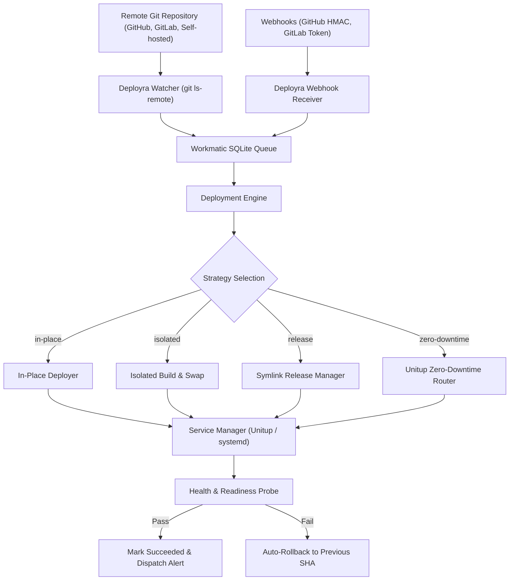

# Deployra 🚀

:::lead
A lightweight, platform-independent VPS deployment orchestrator designed for simplicity, reliability, and zero external infrastructure dependencies.
:::

Deployra eliminates the operational complexity, bloat, and resource hunger of heavy container platforms and third-party orchestration agents. Operating directly on standard Linux, macOS, and BSD environments, Deployra automates continuous Git polling, webhook triggers, atomic directory swaps, zero-downtime traffic switching, systemd process supervision, and automated self-repair.

Built with **Node.js**, **better-sqlite3**, **Workmatic**, and **Unitup**, Deployra is self-contained in a single executable and requires zero Docker, Kubernetes, or cloud subscriptions.

---

## ⚡ Key Highlights

- 🪶 **Zero External Infrastructure**: Self-contained single-binary CLI & daemon. Operates with local SQLite databases in WAL mode (`~/.config/deployra/deployra.db`).
- 🔄 **Four Deployment Strategies**:
  - `in-place`: Fast updates directly in the working directory.
  - `isolated`: Zero-interference build directory with atomic workspace switch.
  - `release`: Capistrano-style timestamped releases with symlink swapping.
  - `zero-downtime`: Native HTTP router traffic shifting with canary weighting and instant generation rollbacks via Unitup.
- ⏱️ **Dual Trigger Mechanisms**:
  - **Git Polling**: Background monitoring of remote repository branches with exponential backoff and jitter.
  - **Webhook Receiver**: Built-in HTTP server supporting GitHub HMAC-SHA256 signatures and GitLab secret tokens.
- 🚦 **Embedded Workmatic Queue**: Crash-resilient SQLite-backed job queue with lease-based concurrency, deduplication, and configurable queue policies (`latest`, `fifo`, `reject`).
- 🔒 **Dynamic Secret Redaction**: Pre-compiled regex secret masker automatically redacts passwords, tokens, private keys, and API credentials from deployment logs in real time.
- 🛡️ **Autonomous Self-Repair Watchdog**:
  - Automatic stale SQLite lock eviction and crash cleanup.
  - Git repository stale lock auto-removal (`index.lock`, `FETCH_HEAD.lock`).
  - Automatic failed deployment retries with cooldown.
  - Subprocess tree termination using POSIX process groups.
  - Health check verification and automatic rollback upon failure.
- 🔔 **Multi-Channel Alerting**: Instant event notifications to Slack, Discord, Telegram, and generic HTTP webhooks.
- 📊 **Rich CLI Suite**: Intuitive status dashboards, live log tailing, deployment history, manual rollbacks, canary promotions, and health diagnostics.

---

## 🚀 Quick Example

Install Deployra globally via npm:

```bash
npm install -g deployra
```

Initialize your project configuration:

```bash
deployra init
```

Start the daemon or run a one-off deployment:

```bash
# Start background watcher daemon
deployra up

# Or trigger a manual deployment immediately
deployra deploy my-app
```

---

## ⚙️ How It Works


