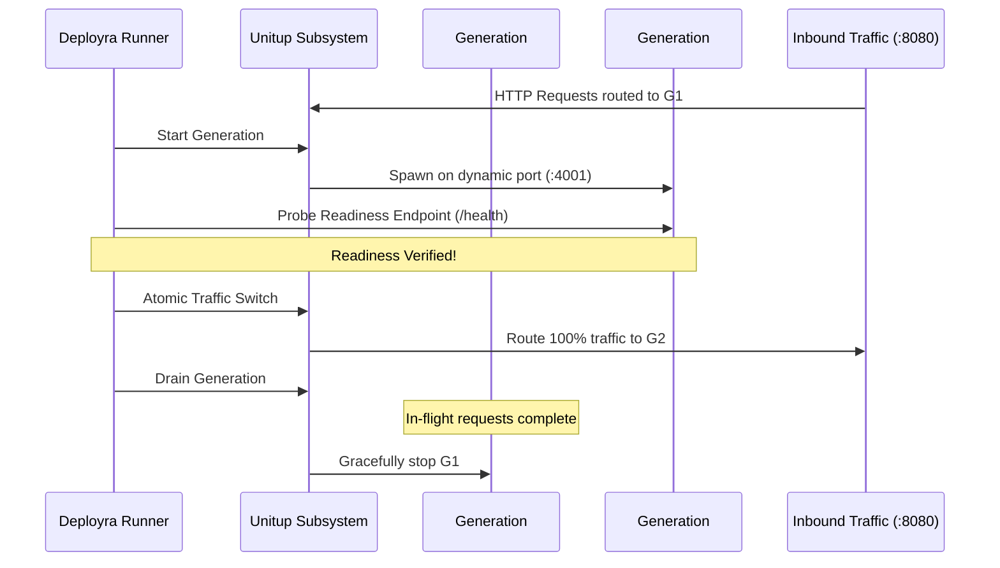

# Zero-Downtime & Canary 🚦

Deployra natively integrates **Unitup v0.3.0** to provide true zero-downtime rolling updates, canary traffic splitting, and sub-second generation rollbacks without external reverse proxies like Nginx or Traefik.

---

## 💡 How Unitup Zero-Downtime Works

When deploying with `strategy: zero-downtime`:



1. **Generation Spawning**: Unitup spawns a new generation of your service on a private dynamic loopback port (e.g. `127.0.0.1:4001`).
2. **Readiness Verification**: Deployra continuously polls the readiness endpoint (`readyCheck.endpoint`). Traffic is not modified until the new process returns HTTP 200.
3. **Atomic Traffic Shift**: Unitup's embedded HTTP router atomically re-points the public entry port (e.g. `8080`) to the new generation with **0 dropped packets**.
4. **Connection Draining**: Previous generation enters the `draining` state. Active long-lived connections and in-flight responses complete within the `drainTimeout` grace period.
5. **Retirement**: Once drained, the old generation process is terminated cleanly.

---

## 🐤 Canary Deployments

Deployra allows you to route a fraction of live production traffic to the new commit before committing to a full deployment:

```bash
deployra deploy my-app --canary --weight 20
```

This starts Generation #2 alongside Generation #1, routing **20%** of inbound traffic to Generation #2 and **80%** to Generation #1.

### Inspecting Canary Generations

Check generation weights, PIDs, and request metrics:

```bash
deployra status
```

Output includes generation tables:
```
Service Generations (my-app):
┌────┬─────────┬────────┬───────┬────────┬──────────┐
│ ID │ Status  │ Port   │ PID   │ Weight │ Requests │
├────┼─────────┼────────┼───────┼────────┼──────────┤
│ #1 │ active  │ :4000  │ 54321 │ 80%    │ 14,200   │
│ #2 │ canary  │ :4001  │ 54400 │ 20%    │ 3,550    │
└────┴─────────┴────────┴───────┴────────┴──────────┘
```

### Promoting a Canary to 100%

When telemetry and error rates look healthy, promote the canary:

```bash
deployra promote my-app
```

Unitup instantly shifts 100% of traffic to Generation #2 and initiates graceful connection draining on Generation #1.

---

## ⚡ Instant Rollback

If readiness checks fail, or if you manually abort a deployment:

```bash
deployra rollback my-app
```

Unitup immediately points routing back to the previous generation without having to re-fetch, re-install, or re-build.
